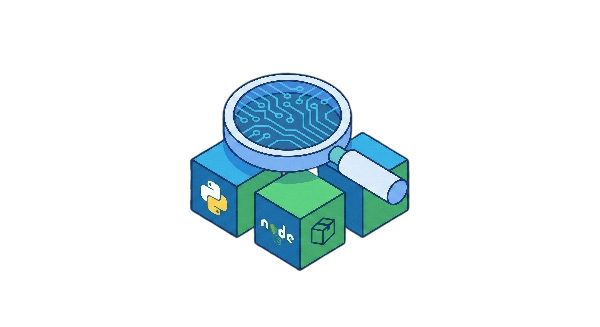
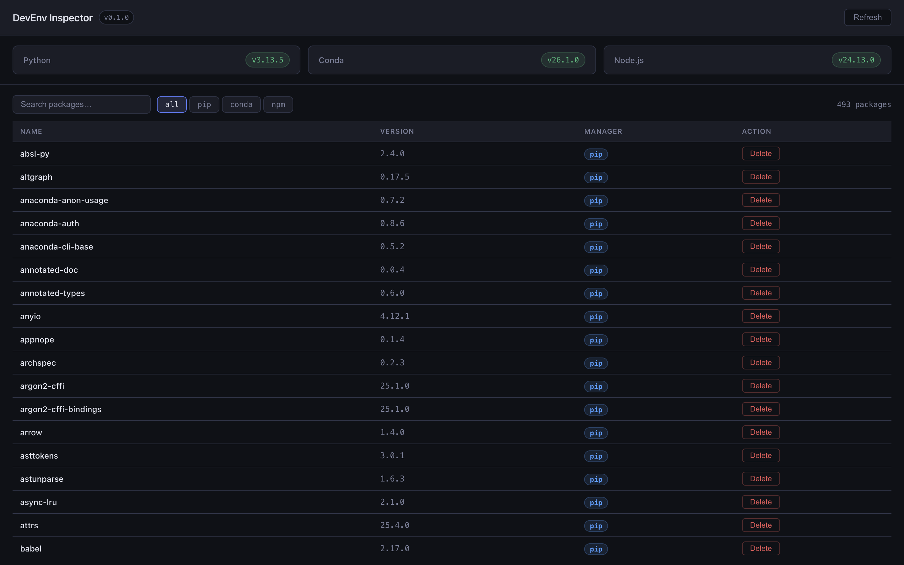

<div align="center">
  

  <h1>DevEnv Inspector</h1>

  <p>A unified desktop GUI for inspecting and managing your development runtimes and global packages — no terminal required.</p>

  <p>
    
    
    
    
    <a href="https://www.npmjs.com/package/devenv-inspector-cli">
      
    </a>
  </p>

  <p>
    <a href="https://github.com/ali-aldahmani/devenv-inspector/issues">
      
    </a>
    <a href="https://github.com/ali-aldahmani/devenv-inspector/issues">
      
    </a>
    <a href="https://github.com/ali-aldahmani/devenv-inspector/fork">
      
    </a>
  </p>
</div>

---

## What is this?

Developers who work across Python, Node.js, and Conda constantly switch between terminal commands just to see what's installed. DevEnv Inspector puts it all in one window — version badges, a searchable package list, and one-click uninstallation.

<div align="center">
  
</div>

---

## Features

- **Runtime detection** — instantly shows installed versions of Python, Conda, and Node.js
- **Unified package table** — all pip, conda, and npm global packages in one searchable list
- **Safe uninstallation** — confirmation dialog before any package is removed
- **Filter by manager** — quickly scope the list to pip / conda / npm
- **Graceful fallbacks** — missing runtimes show "Not Installed" and hide irrelevant packages
- **No internet required** — everything runs locally against your machine

---

## CLI Companion

Prefer the terminal? The same functionality is available as a standalone npm package — **[devenv-inspector-cli on npm](https://www.npmjs.com/package/devenv-inspector-cli)**:

```bash
npm install -g devenv-inspector-cli
```

```bash
devenv list                        # show all runtimes
devenv packages                    # list all global packages
devenv packages --runtime pip      # filter by manager
devenv uninstall numpy --runtime conda
devenv info python
```

> Source lives in [`cli/`](./cli) — same repo, zero Electron. Docker support included.

---

## Built With

<div align="center">
  
</div>

<div align="center">

| Technology | Role |
|---|---|
|  | Desktop shell & system command execution |
|  | Renderer UI & component state |
|  | Build tooling via electron-vite |
|  | Runtime & IPC bridge |
|  | pip package detection & uninstall |
|  | Global npm package detection |
|  | Global yarn package detection & uninstall |
|  | Global pnpm package detection & uninstall |
|  | Containerized CLI environment |
|  | Version control |

</div>

---

## Getting Started

### Prerequisites

- [Node.js](https://nodejs.org) v18 or later
- npm v9 or later

### Installation

```bash
# Clone the repository
git clone https://github.com/ali-aldahmani/devenv-inspector.git

# Navigate into the project
cd devenv-inspector

# Install dependencies
npm install

# Start the app in development mode
npm run dev
```

### Package as a macOS app

```bash
npm run package
```

This builds the source and produces a `.dmg` installer in `dist/`:
- `DevEnv Inspector-0.1.0-arm64.dmg` — Apple Silicon
- `DevEnv Inspector-0.1.0.dmg` — Intel

---

## How It Works

```
┌─────────────────────────────────────────────┐
│              Renderer Process               │
│   React UI — table, filters, dialogs        │
└──────────────────┬──────────────────────────┘
                   │  IPC (contextBridge)
┌──────────────────▼──────────────────────────┐
│               Main Process                  │
│  detectors.js  →  python3 / conda / node    │
│  parsers.js    →  pip / conda / npm --json  │
│  ipcHandlers.js → uninstall routing         │
│  shell.js      →  login shell executor      │
└─────────────────────────────────────────────┘
```

Every command runs through the user's login shell (`zsh -i -l -c`) so that conda, pyenv, nvm, and other shell-managed tools are always found — both in dev mode and in the packaged `.app`.

---

## Supported Runtimes (v0.1.0)

| Runtime | Packages | Uninstall |
|---|---|---|
| Python | `python3 -m pip list` | `python3 -m pip uninstall -y` |
| Anaconda | `conda list --json` | `conda remove -y` |
| Node.js | `npm list -g --depth=0` | `npm uninstall -g` |
| Yarn | `yarn global list --json` | `yarn global remove` |
| pnpm | `pnpm list -g --json` | `pnpm remove -g` |

---

## Roadmap

- [ ] nvm / pyenv support
- [ ] Virtual environment detection
- [ ] Package update detection
- [ ] Dependency graph visualization
- [ ] Dark / light mode toggle
- [ ] Plugin system for new package managers
- [ ] Windows & Linux support

---

## Contributing

Contributions are what make open source great. Any contribution you make is **hugely appreciated**.

1. Fork the repository
2. Create a feature branch — `git checkout -b feature/your-idea`
3. Commit your changes — `git commit -m "Add your feature"`
4. Push to the branch — `git push origin feature/your-idea`
5. Open a Pull Request

</a>

---

## License

Distributed under the **MIT License** — see [`LICENSE`](LICENSE) for details.

---

<div align="center">
  <sub>Built with care for developers who just want to see what's on their machine.</sub>
</div>
